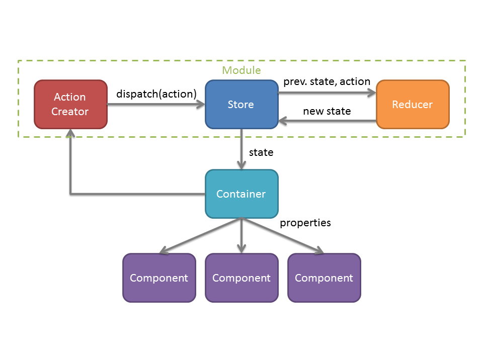

# redux-starter
A starter template for building nodejs API and react/redux apps

To get started, run ```npm install``` and then ```npm run dev``` to start developing the client side with React hot module reload.

To enable reloading on server changes (via nodemon) and hmr on the client side, run ```npm run devServer```.

# Client
The client side is built with the following tools:

* [ReactJS](https://facebook.github.io/react/) for client side interface ([using ES6+!](https://babeljs.io/blog/2015/06/07/react-on-es6-plus))
* [redux](http://redux.js.org/) for maintaining app state, instead of [Flux](http://fluxxor.com/what-is-flux.html)
  * [redux-thunk](https://github.com/gaearon/redux-thunk) which lets you write action creators that return a function instead of an action
  * [react-router](https://github.com/ReactTraining/react-router) for routing on the client side
  * [redux-logger](https://github.com/evgenyrodionov/redux-logger) for debugging redux store via the browser console
  * [modular 'ducks' pattern](https://github.com/erikras/ducks-modular-redux) for better organization
* [axios](https://github.com/mzabriskie/axios) for a promise based HTTP client
* [webpack](https://webpack.github.io/docs/what-is-webpack.html) for bundling the client JavaScript
  * [webpack-dev-middleware](https://github.com/webpack/webpack-dev-middleware) for a emitting changes to webpack bundles 
  * [webpack-hot-middleware](https://github.com/glenjamin/webpack-hot-middleware) for hot module reloading (hmr) in the browser, without webpack-dev-server
  * See [here](https://www.codementor.io/tamizhvendan/beginner-guide-setup-reactjs-environment-npm-babel-6-webpack-du107r9zr) for a beginner guide in setting up stack
* [babel](http://babeljs.io/) for transpiling next-gen JavaScript (i.e. ES6, ReactJS) into browser compatible JavaScript
* [eslint](http://eslint.org/) for identifying and reporting on patterns in JavaScript
  * [airbnb's style guide](https://github.com/airbnb/javascript) for enforcing 'a reasonable approach to JavaScript'

## Structure
The client side project folder structure is:

* components
  * The reusable UI components where all state is injected by their parent container 
* containers
  * The special components who have the redux store's state bound to this properties.  
  * The containers load dummy components and inject the state into them
  * A container is usually equivalent to a web page
* redux
  * Where the applications state is managed via independent reducers and a redux store. See [React-Redux](#react-redux) for more.
  * Each module defines its own action types, action creators, and a reducer
* templates
  * Where the index.html and favicon.ico are kept
  * All UI is managed via the components
* client.js
  * Where the React app is initialized and routes are defined

## React-Redux


## Getting Started
To start developing an app, you'll want to identify your containers (i.e. pages or views), components (i.e re-usable UI controls), and reducers (i.e. how the app state is to be managed).

New containers must be added to [client.js](client/client.js) using the React router. New reducers must be loaded into the Redux store by using combineReducers in [store.js](client/redux/store.js). 

# Server
The server side is built with the following tools:

* [express](https://github.com/expressjs/express) for web server
  * When ```NODE_ENV=production``` webpack middleware will be injected
* [mongoose](https://github.com/Automattic/mongoose) for asynchronous access to MongoDB
